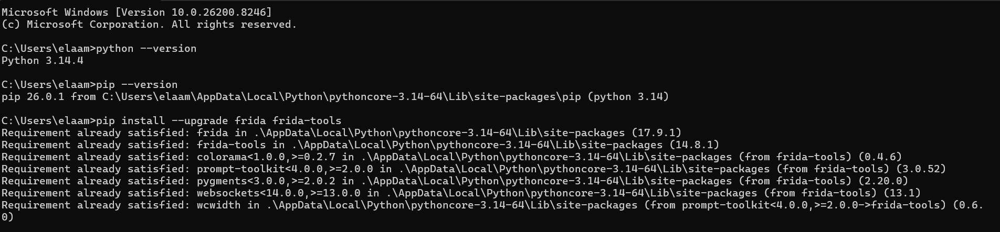
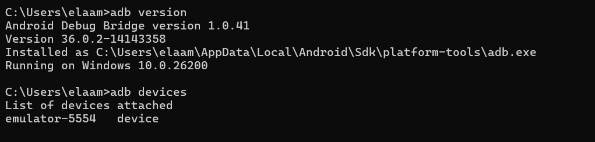
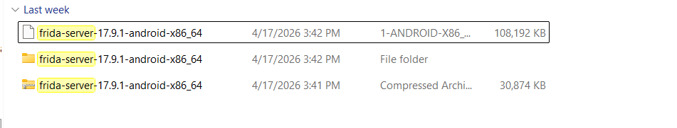
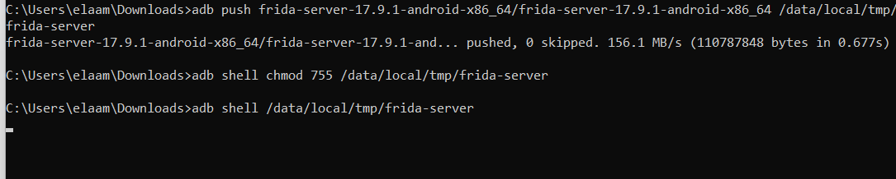
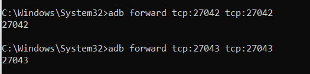
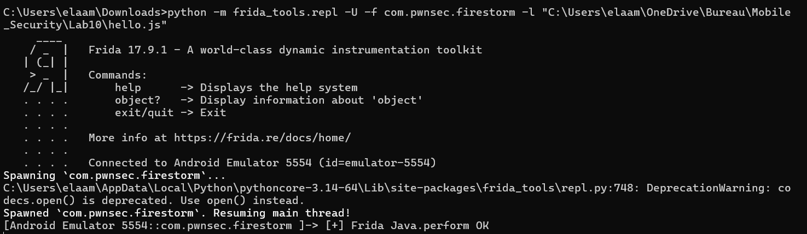
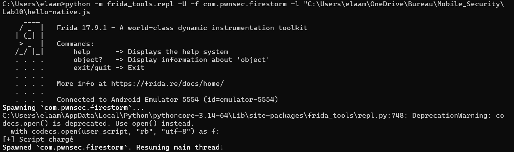
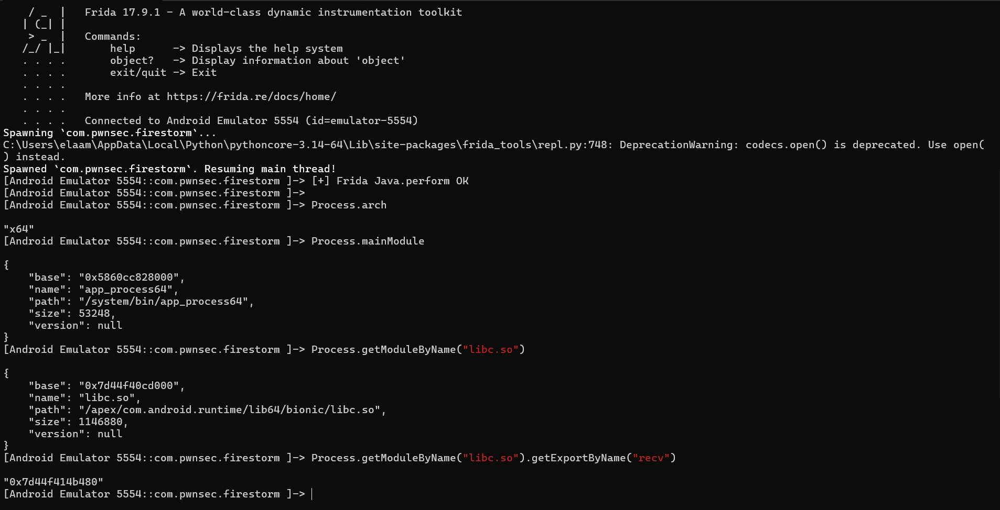

#  Lab 10 — Analyse dynamique Android avec Frida (FireStorm)

## 📌 Objectif du laboratoire

Ce laboratoire présente l’utilisation de **Frida** pour instrumenter dynamiquement une application Android nommée **FireStorm**.  
L’objectif est de préparer l’environnement, lancer `frida-server` sur un émulateur Android, connecter Frida depuis Windows, puis exécuter des scripts JavaScript pour interagir avec l’application.

---


---

## 1️⃣ Vérification de Python, pip et Frida

La première étape consiste à vérifier que **Python** et **pip** sont bien installés, puis à installer ou mettre à jour **Frida** et **frida-tools**.

```bash
python --version
pip --version
pip install --upgrade frida frida-tools
```



**Description :**  
Cette capture montre que Python est installé correctement, que pip fonctionne, et que les paquets `frida` et `frida-tools` sont déjà installés avec les bonnes versions.

---

## 2️⃣ Vérification de ADB et de l’émulateur Android

Ensuite, on vérifie la version de **ADB** et la connexion avec l’émulateur Android.

```bash
adb version
adb devices
```



**Description :**  
ADB est bien installé et l’émulateur Android est détecté avec l’identifiant `emulator-5554`. Le statut `device` confirme que la connexion est fonctionnelle.

---

## 3️⃣ Téléchargement de la bonne version de frida-server

Comme l’émulateur utilise une architecture **x86_64**, il faut utiliser la version correspondante de `frida-server`.



**Description :**  
La capture montre le fichier `frida-server-17.9.1-android-x86_64`, qui correspond à l’architecture de l’émulateur Android.

---

## 4️⃣ Vérification de l’architecture Android

Pour confirmer l’architecture de l’émulateur, on exécute la commande suivante :

```bash
adb shell getprop ro.product.cpu.abi
```



**Description :**  
Le résultat `x86_64` confirme que le bon binaire `frida-server` doit être utilisé : `frida-server-android-x86_64`.

---

## 5️⃣ Envoi et exécution de frida-server sur l’émulateur

Le binaire `frida-server` est envoyé dans `/data/local/tmp/`, puis les permissions d’exécution sont ajoutées.

```bash
adb push frida-server-17.9.1-android-x86_64/frida-server-17.9.1-android-x86_64 /data/local/tmp/frida-server
adb shell chmod 755 /data/local/tmp/frida-server
adb shell /data/local/tmp/frida-server
```



**Description :**  
Cette étape montre que `frida-server` a été transféré avec succès vers l’émulateur, puis lancé depuis `/data/local/tmp/`.

> Remarque : après le lancement de `frida-server`, le terminal peut rester bloqué. C’est normal, car le serveur tourne en premier plan.

---

## 6️⃣ Redirection des ports Frida

Frida utilise les ports `27042` et `27043`. On les redirige avec ADB pour permettre la communication entre Windows et l’émulateur.

```bash
adb forward tcp:27042 tcp:27042
adb forward tcp:27043 tcp:27043
```



**Description :**  
Les ports Frida sont correctement redirigés. Cela permet au client Frida sur Windows de communiquer avec `frida-server` sur Android.

---

## 7️⃣ Lancement de l’application avec Frida

On lance l’application cible avec Frida en utilisant son nom de package :

```bash
python -m frida_tools.repl -U -f com.pwnsec.firestorm -l "C:\Users\elaam\OneDrive\Bureau\Mobile_Security\Lab10\hello.js"
```



**Description :**  
Frida se connecte à l’émulateur, lance le package `com.pwnsec.firestorm`, charge le script `hello.js`, puis reprend l’exécution du thread principal.

Le message important est :

```text
[+] Frida Java.perform OK
```

Cela confirme que le script Frida fonctionne correctement avec l’environnement Java Android.

---

## 8️⃣ Chargement du script native

Un second script, `hello-native.js`, est utilisé pour travailler avec les modules natifs et les bibliothèques chargées en mémoire.

```bash
python -m frida_tools.repl -U -f com.pwnsec.firestorm -l "C:\Users\elaam\OneDrive\Bureau\Mobile_Security\Lab10\hello-native.js"
```



**Description :**  
Le script `hello-native.js` est chargé avec succès. Il permet de préparer l’analyse native de l’application, notamment l’inspection des modules, de l’architecture et des fonctions exportées.

---

## 9️⃣ Exploration des modules avec Frida

Dans le REPL Frida, on peut exécuter plusieurs commandes pour inspecter le processus :

```javascript
Process.arch
Process.mainModule
Process.getModuleByName("libc.so")
Process.getModuleByName("libc.so").getExportByName("recv")
```


**Description :**  
Cette capture montre l’utilisation de Frida pour obtenir :

- l’architecture du processus : `x64`
- le module principal : `app_process64`
- les informations de la bibliothèque native `libc.so`
- l’adresse de la fonction exportée `recv`

Cela confirme que Frida peut accéder aux modules natifs chargés en mémoire.

---

## 🔟 Interface de l’application FireStorm

Après le lancement, l’application affiche une image de fond avec le texte :

```text
Wait, it's all phone background?
Always has been
```


**Description :**  
Cette capture montre l’interface principale de l’application FireStorm sur l’émulateur Android. L’interface visible ne révèle rien d’important directement, ce qui justifie l’utilisation de Frida pour l’analyse dynamique.


## ✅ Résultat final

À la fin du laboratoire, nous avons réussi à :

- Installer et vérifier Frida sur Windows.
- Vérifier la connexion ADB avec l’émulateur Android.
- Identifier l’architecture de l’émulateur : `x86_64`.
- Télécharger et lancer le bon `frida-server`.
- Rediriger les ports Frida.
- Lancer l’application `com.pwnsec.firestorm` avec Frida.
- Charger des scripts JavaScript Frida.
- Utiliser `Java.perform()`.
- Explorer les modules natifs avec Frida.
- Trouver une instance de `MainActivity`.
- Générer un mot de passe Firebase depuis l’application.

---

## 🧠 Conclusion

Ce laboratoire montre l’importance de **Frida** dans l’analyse dynamique Android.  
Contrairement à l’analyse statique, Frida permet d’interagir directement avec l’application pendant son exécution, d’appeler des méthodes internes, d’inspecter les modules natifs et de modifier le comportement de l’application en temps réel.

Cette approche est très utile pour :

- le reverse engineering Android ;
- l’analyse de malware mobile ;
- les tests de sécurité mobile ;
- le bypass de protections ;
- l’extraction de secrets en mémoire.

---

