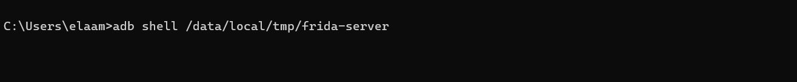
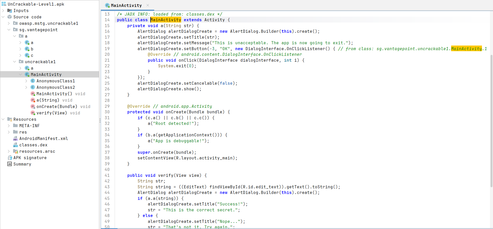
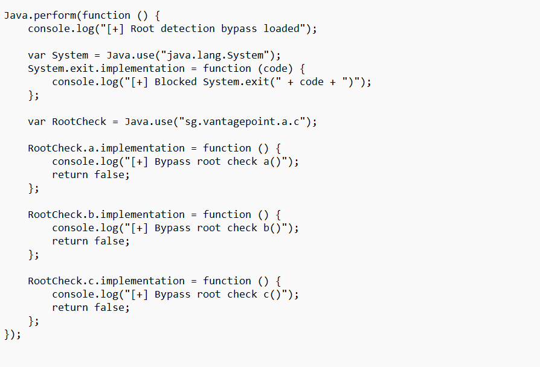

# Bypass Root Detection — UnCrackable Level 1

## Objectif

Ce rapport explique comment bypasser la détection root de l’application **UnCrackable Level 1** avec **Frida**.

L’application détecte que l’environnement est rooté et affiche une alerte indiquant que l’application va se fermer.

---

## 1. Détection du root par l’application

Au lancement, l’application affiche le message suivant :

> Root detected! This is unacceptable. The app is now going to exit.


Cette alerte bloque l’utilisation normale de l’application.

---

## 2. Lancement de frida-server

Pour utiliser Frida, il faut lancer `frida-server` sur l’émulateur Android.

Commande utilisée :

```powershell
adb shell /data/local/tmp/frida-server
```



---

## 3. Analyse du code avec JADX

L’APK est ouvert avec **JADX** pour analyser le code Java décompilé.

Dans `MainActivity`, on remarque cette partie :

```java
if (c.a() || c.b() || c.c()) {
    a("Root detected!");
}
```

Cela signifie que l’application utilise les méthodes `a()`, `b()` et `c()` pour détecter le root.

La classe ciblée est :

```java
sg.vantagepoint.a.c
```

Si une de ces méthodes retourne `true`, l’application affiche l’alerte **Root detected!**.



---

## 4. Script Frida utilisé

Le fichier `bypass.js` permet d’intercepter les fonctions de détection root.

```javascript
Java.perform(function () {
    console.log("[+] Root detection bypass loaded");

    var System = Java.use("java.lang.System");
    System.exit.implementation = function (code) {
        console.log("[+] Blocked System.exit(" + code + ")");
    };

    var RootCheck = Java.use("sg.vantagepoint.a.c");

    RootCheck.a.implementation = function () {
        console.log("[+] Bypass root check a()");
        return false;
    };

    RootCheck.b.implementation = function () {
        console.log("[+] Bypass root check b()");
        return false;
    };

    RootCheck.c.implementation = function () {
        console.log("[+] Bypass root check c()");
        return false;
    };
});
```



### Explication du script

- `Java.perform()` attend que l’environnement Java Android soit prêt.
- `Java.use("java.lang.System")` permet d’intercepter `System.exit()`.
- `System.exit.implementation` empêche l’application de se fermer.
- `Java.use("sg.vantagepoint.a.c")` cible la classe responsable de la détection root.
- Les méthodes `a()`, `b()` et `c()` sont forcées à retourner `false`.
- `false` signifie que le root n’est pas détecté.

---

## 5. Exécution avec Frida

Commande utilisée :

```powershell
python -m frida_tools.repl -U -f owasp.mstg.uncrackable1 -l .\bypass.js
```

Résultat affiché dans la console :

```text
[+] Root detection bypass loaded
[+] Bypass root check a()
[+] Bypass root check b()
[+] Bypass root check c()
```


Le script est chargé correctement et les méthodes de détection root sont interceptées.

---

## 6. Résultat final

Après le bypass, l’application ne se ferme plus et l’alerte root ne bloque plus l’interface.


L’application est maintenant accessible normalement.

---

## Conclusion

Le bypass fonctionne car Frida intercepte les méthodes responsables de la détection root pendant l’exécution de l’application.

Les méthodes suivantes :

```java
c.a()
c.b()
c.c()
```

sont forcées à retourner :

```java
false
```

Donc l’application pense que l’appareil n’est pas rooté.

---

## Commandes importantes

Lancer `frida-server` :

```powershell
adb shell /data/local/tmp/frida-server
```

Lancer l’application avec le script Frida :

```powershell
python -m frida_tools.repl -U -f owasp.mstg.uncrackable1 -l .\bypass.js
```

Si l’application reste en pause dans Frida :

```javascript
%resume
```
