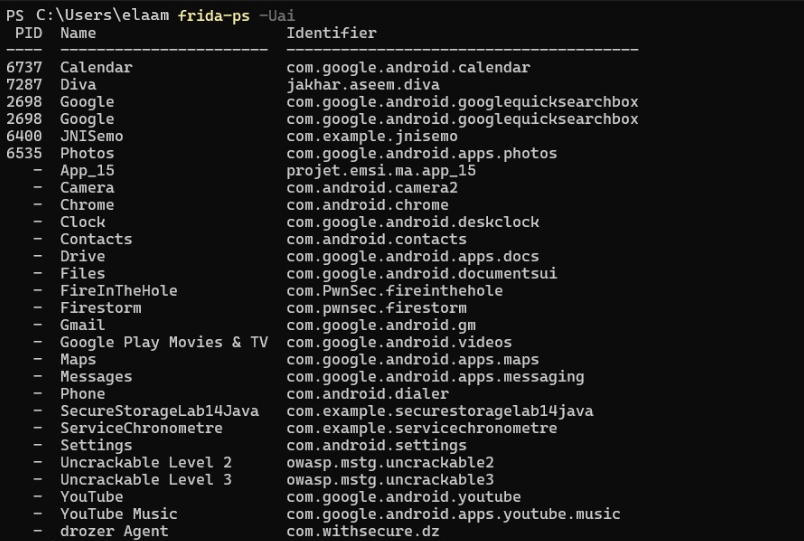
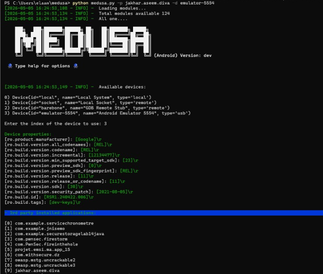

# Android Root Detection Bypass with Medusa


<p align="center">
  
  
  
  
</p>

---

# Overview

This lab demonstrates how to bypass Android root detection dynamically using:

- Frida
- Medusa
- ADB
- Android Emulator

The objective is to disable root detection checks at runtime without modifying the APK.

---

# Features

- Frida setup
- frida-server deployment
- Medusa installation
- Dynamic instrumentation
- Universal root detection bypass
- Android app runtime analysis

---

# Prerequisites

| Tool | Verification |
|---|---|
| Python | python --version |
| pip | pip --version |
| ADB | adb version |
| Frida | frida --version |

---

# Step 1 — Install Frida

```powershell
pip install --upgrade frida frida-tools
frida --version
python -c "import frida; print(frida.__version__)"
```


---

# Step 2 — Verify ADB

```powershell
adb version
adb devices
```


---

# Step 3 — Start frida-server

```powershell
adb push frida-server /data/local/tmp/
adb shell chmod 755 /data/local/tmp/frida-server
adb shell "/data/local/tmp/frida-server -l 0.0.0.0"
```


---

# Step 4 — Install Medusa

## Clone repository

```powershell
git clone https://github.com/Ch0pin/medusa.git
cd Medusa
```


---

## Install dependencies

```powershell
pip install -r requirements.txt
```


---

# Step 5 — Verify Applications

```powershell
frida-ps -Uai
```



---

# Step 6 — Launch Medusa

```powershell
python medusa.py -p jakhar.aseem.diva -d emulator-5554
```



---

# Step 7 — Enable Root Bypass

Inside Medusa shell:

```text
medusa> use root_detection/universal_root_detection_bypass
```


---

# Step 8 — Run Target Application

```text
medusa> run jakhar.aseem.diva
```


---

# Root Detection Explained

Applications commonly check:

- Build.TAGS
- File.exists()
- Runtime.exec("su")
- busybox binaries
- system properties

Medusa hooks these checks dynamically and returns safe values.

---

# Example Frida Root Bypass

```javascript
Java.perform(function() {

    var Build = Java.use("android.os.Build");
    Build.TAGS.value = "release-keys";

    var File = Java.use("java.io.File");

    File.exists.implementation = function() {

        var path = this.getAbsolutePath();

        if (path.indexOf("su") !== -1 ||
            path.indexOf("busybox") !== -1) {

            return false;
        }

        return this.exists();
    };

    console.log("[*] Root bypass actif !");
});
```

---

# Useful Commands

## Frida

```powershell
frida-ps -Uai
```

```powershell
frida --version
```

---

## Medusa

```powershell
python medusa.py --help
```

```text
use root_detection/universal_root_detection_bypass
```

```text
run jakhar.aseem.diva
```

---

## ADB

```powershell
adb devices
```

```powershell
adb shell
```

---

# Project Structure

```text
├── Images/
│   ├── 1.png
│   ├── 2.png
│   ├── 3.png
│   ├── 4.png
│   ├── 5.png
│   ├── 6.png
│   ├── 7.png
│   ├── 8.png
│   └── 9.png
│
├── root_bypass.js
└── README.md
```

---

# Conclusion

This lab demonstrates how Medusa and Frida can dynamically bypass Android root detection mechanisms during runtime analysis.

The instrumentation hooks common root detection APIs and allows analysts to continue testing protected Android applications.

---

# Disclaimer

This project is intended for:

- Educational purposes
- Mobile security research
- Authorized penetration testing

Do not use these techniques on unauthorized applications or systems.

---

# References

- https://frida.re
- https://github.com/Ch0pin/medusa
- https://developer.android.com/tools/adb
