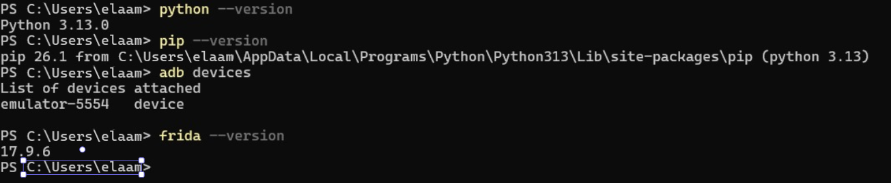
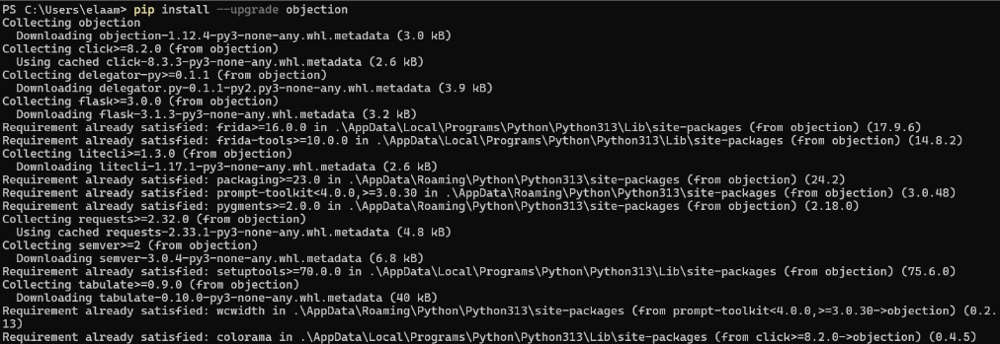
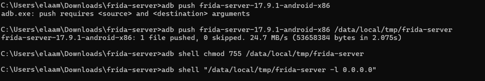
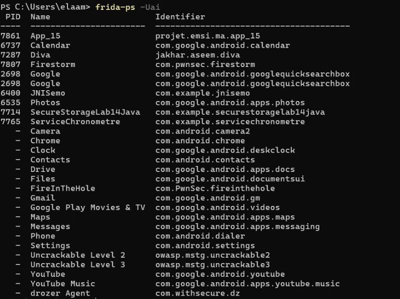
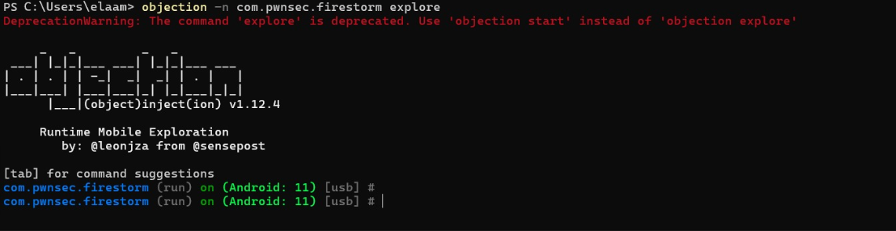
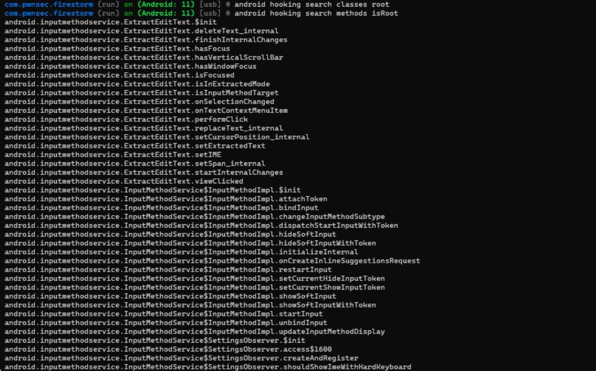

# LAB 13 : Android Root Detection Bypass with Objection


# Overview

This lab demonstrates Android root detection bypass using Frida and Objection.

---

# Step 1 — Verify Environment

```powershell
python --version
pip --version
adb devices
frida --version
```



---

# Step 2 — Install Objection

```powershell
pip install --upgrade objection
```



---

# Step 3 — Verify Objection

```powershell
objection --help
objection version
```


---

# Step 4 — Start frida-server

```powershell
adb push frida-server-17.9.1-android-x86 /data/local/tmp/frida-server
adb shell chmod 755 /data/local/tmp/frida-server
adb shell "/data/local/tmp/frida-server -l 0.0.0.0"
```



---

# Step 5 — Verify Applications

```powershell
frida-ps -Uai
```



---

# Step 6 — Attach Objection

```powershell
objection -n com.pwnsec.firestorm explore
```



---

# Step 7 — Search Root Detection Methods

```bash
android hooking search classes root
android hooking search methods isRoot
```



---

# Step 8 — Disable Root Detection & SSL Pinning

```bash
android root disable
android sslpinning disable
```


---

# Features

- Root detection bypass
- SSL pinning bypass
- Runtime instrumentation
- Java method hooking
- Frida integration

---


---

# Disclaimer

For educational and authorized security testing only.
