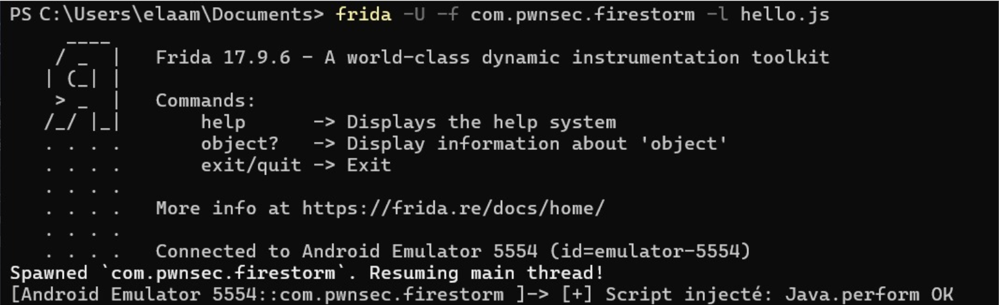
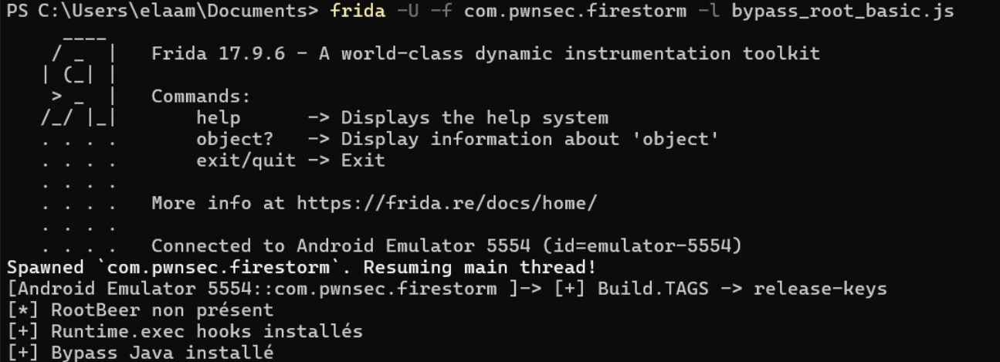
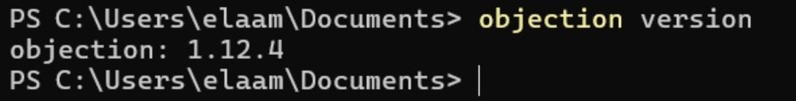
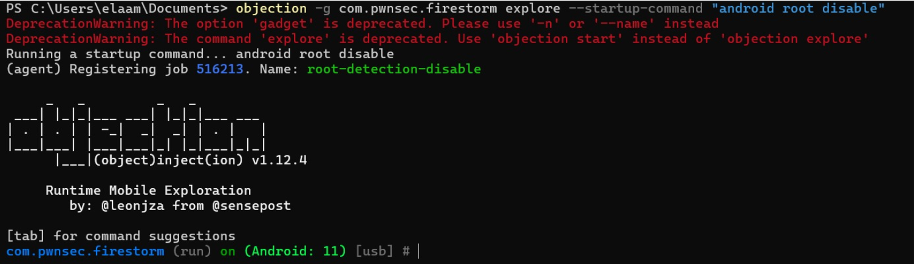
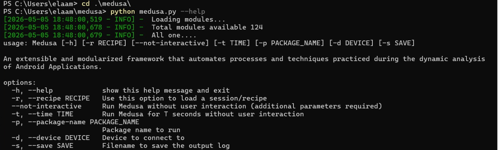
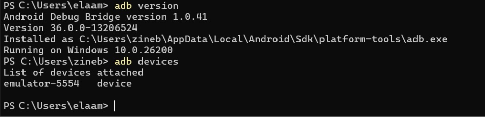
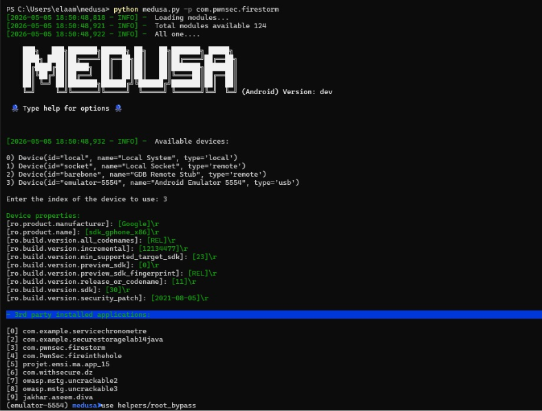

# LAB14 Android Root Detection Bypass Lab with Frida, Objection & Medusa

<p align="center">
  
  
  
  
  
</p>

---

# Overview

This lab demonstrates how to bypass Android root detection dynamically using:

- Frida
- Objection
- Medusa

The goal is to analyze Android applications without modifying the APK.

---

# Features

- Frida setup on Windows
- ADB connection with Android emulator
- frida-server deployment
- Dynamic Java hooks
- Root detection bypass
- Objection automation
- Medusa integration
- Runtime instrumentation

---

# Environment Setup

## Install Frida

```powershell
pip install --upgrade frida frida-tools
```

Verify installation:

```powershell
frida --version
python -c "import frida; print(frida.__version__)"
```

<p align="center">
  
</p>

---

# Install ADB

```powershell
adb version
adb devices
```

<p align="center">
  
</p>

---

# Start frida-server

```powershell
adb push frida-server-17.9.1-android-x86 /data/local/tmp/frida-server
adb shell chmod 755 /data/local/tmp/frida-server
adb shell "/data/local/tmp/frida-server -l 0.0.0.0"
```

<p align="center">
  
</p>

---

# Verify Frida Connection

```powershell
frida-ps -Uai
```

<p align="center">
  
</p>

---

# Frida Injection

## hello.js

```javascript
Java.perform(function () {
    console.log("[+] Script injecté: Java.perform OK");
});
```

```powershell
frida -U -f com.pwnsec.firestorm -l hello.js
```

<p align="center">
  
</p>

---

# Root Detection Bypass

## bypass_root_basic.js

```javascript
Java.perform(function () {

    try {
        const Build = Java.use('android.os.Build');

        Object.defineProperty(Build, 'TAGS', {
            get: function () {
                return 'release-keys';
            }
        });

        console.log('[+] Build.TAGS -> release-keys');

    } catch (e) {}

    console.log("[+] Bypass Java installé");
});
```

```powershell
frida -U -f com.pwnsec.firestorm -l bypass_root_basic.js
```

<p align="center">
  
</p>

---

# Objection

```powershell
objection version
```

<p align="center">
  
</p>

```powershell
objection -g com.pwnsec.firestorm explore --startup-command "android root disable"
```

<p align="center">
  
</p>

---

# Medusa

```powershell
python medusa.py -p com.pwnsec.firestorm
```

<p align="center">
  
</p>

---

# Medusa Help

```powershell
python medusa.py --help
```

<p align="center">
  
</p>

---


