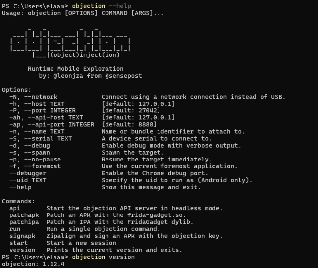
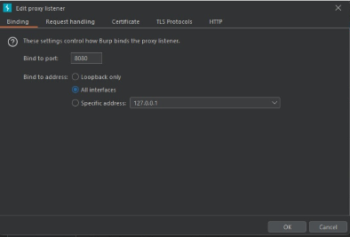
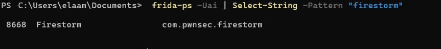
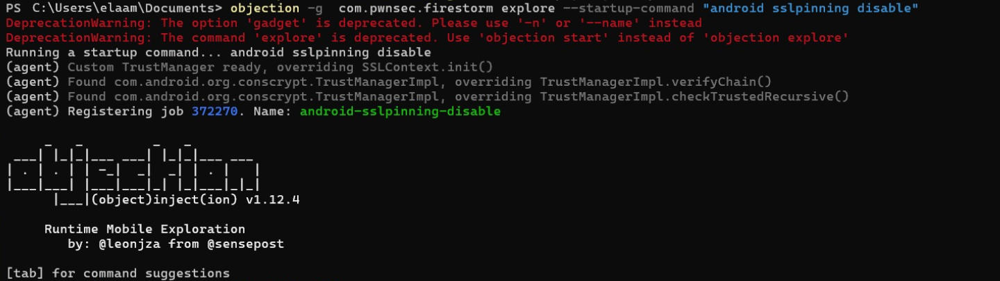

# Android HTTPS Inspection & SSL Pinning Bypass using Objection


<p align="center">
  
  
  
  
</p>

---

# Overview

This lab demonstrates how to bypass SSL Pinning on Android applications using:

- Frida
- Objection
- Burp Suite
- ADB

The objective is to intercept HTTPS traffic dynamically without modifying the APK.

---

# Features

- Frida installation
- Objection setup
- frida-server deployment
- SSL pinning bypass
- HTTPS interception
- Burp Suite configuration
- Android proxy setup
- Runtime instrumentation

---

# Quick Verification

```powershell
python --version
pip --version
adb version
```


---

# Install Frida & Objection

## Install tools

```powershell
pip install --upgrade objection frida frida-tools
```

## Verify installation

```powershell
objection --version
frida --version
python -c "import frida; print(frida.__version__)"
```




---

# Start frida-server

## Push frida-server

```powershell
adb push frida-server-17.9.1-android-x86 /data/local/tmp/frida-server
```

## Make executable

```powershell
adb shell chmod 755 /data/local/tmp/frida-server
```

## Launch frida-server

```powershell
adb shell "/data/local/tmp/frida-server -l 0.0.0.0"
```


---

# Verify Device Connection

```powershell
frida-ps -Uai
```



---

# Configure Burp Suite

## Configure listener

- Port: 8080
- Bind to: All interfaces


---

# Configure Android Proxy

Set the Android Wi-Fi proxy manually:

- Hostname: Your PC IP
- Port: 8080



---

# Find Target Application

```powershell
frida-ps -Uai | Select-String -Pattern "firestorm"
```



---

# Disable SSL Pinning

## Spawn mode (recommended)

```powershell
objection -g com.pwnsec.firestorm explore --startup-command "android sslpinning disable"
```


---

# Attach mode

```powershell
objection -g com.pwnsec.firestorm explore
```

Inside Objection console:

```powershell
android sslpinning disable
```


---

# Useful Commands

## Frida

```powershell
frida-ps -Uai
```

```powershell
frida --version
```

---

## Objection

```powershell
objection --help
```

```powershell
objection version
```

```powershell
android sslpinning disable
```

---

## ADB

```powershell
adb devices
```

```powershell
adb shell
```

---

# SSL Pinning Explained

SSL Pinning is used by applications to prevent man-in-the-middle attacks by validating server certificates directly inside the application.

Objection dynamically patches:

- TrustManager
- SSLContext
- verifyChain()
- checkTrustedRecursive()

This allows Burp Suite or mitmproxy certificates to be trusted at runtime.

---

# Project Structure

```text
├── Images/
│   ├── 1.png
│   ├── 2.png
│   ├── 3.png
│   ├── 4.png
│   ├── 5.png
│   ├── 6.png
│   ├── 7.png
│   ├── 8.png
│   ├── 9.png
│   └── 10.png
│
└── README.md
```

---

# Disclaimer

This project is intended for:

- Educational purposes
- Mobile application security testing
- Authorized penetration testing

Do not use these techniques without authorization.

---

# References

- https://frida.re
- https://github.com/sensepost/objection
- https://portswigger.net/burp
- https://developer.android.com/tools/adb
