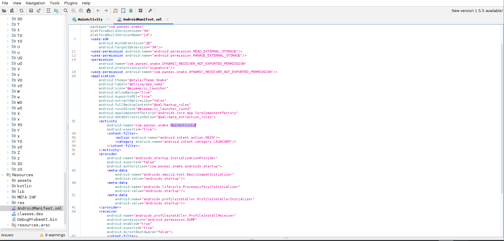
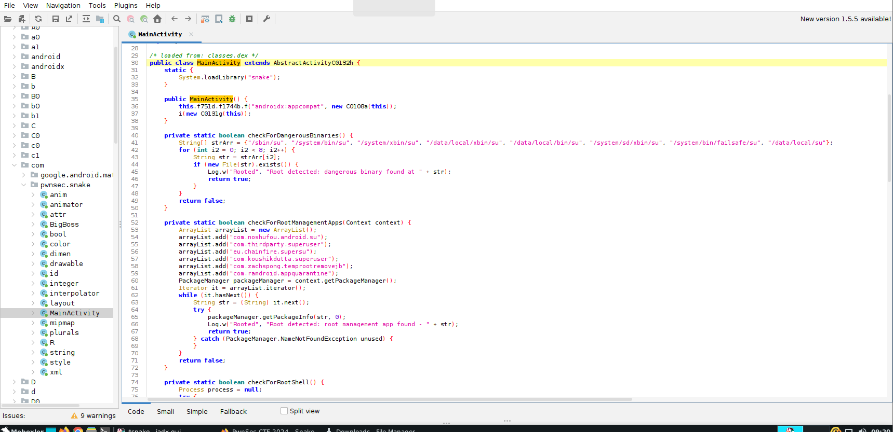

# Write-up — Challenge Android `snake.apk`

## 1. Installation de l’APK

On commence par installer l’application sur l’émulateur Android :

```bash
adb install -r snake.apk
```

L’application ne semble rien afficher d’intéressant au premier lancement.  
Cependant, un détail attire l’attention : elle demande des permissions liées au stockage externe.

---

## 2. Analyse du `AndroidManifest.xml`

Après décompilation, on peut voir dans le manifest que l’application demande l’accès au stockage :

```xml
<uses-permission android:name="android.permission.READ_EXTERNAL_STORAGE"/>
<uses-permission android:name="android.permission.MANAGE_EXTERNAL_STORAGE"/>
```

Cela suggère fortement que l’application lit un fichier externe pour déclencher une logique cachée.

### Capture d’écran — AndroidManifest.xml



*Figure 1 : Permissions de stockage visibles dans le manifest de l’application.*

---

## 3. Décompilation de l’APK

On décompile l’APK avec `apktool` :

```bash
apktool d snake.apk
```

Puis on ouvre le code avec `jadx-gui` pour analyser les classes Java.

---

## 4. Inspection de `MainActivity`

Dans `MainActivity`, on remarque plusieurs protections :

- détection du root
- détection de Frida
- gestion de permissions

Mais la partie la plus intéressante est une méthode qui récupère un extra d’`Intent` nommé `SNAKE`.

### Logique importante

L’application vérifie :

- si l’intent contient la clé `SNAKE`
- si sa valeur est exactement `BigBoss`

Ensuite, elle tente d’ouvrir le fichier suivant :

```text
/storage/emulated/0/snake/Skull_Face.yml
```

Si le fichier n’existe pas, l’application écrit une erreur dans les logs.

### Capture d’écran — `MainActivity`



*Figure 2 : Vue de `MainActivity` dans JADX, avec les mécanismes de détection et la logique intéressante à analyser.*

---

## 5. Déclencher le bon chemin avec `adb`

Comme `MainActivity` attend un extra d’intent, on peut lancer l’activité manuellement avec `am` :

```bash
adb shell am start -n com.pwnsec.snake/.MainActivity -e SNAKE BigBoss
```

Ensuite, on peut surveiller les logs :

```bash
adb logcat | grep "YML File"
```

À ce stade, on observe que l’application cherche un fichier YAML précis :

```text
/storage/emulated/0/snake/Skull_Face.yml
```

Cela confirme que le point d’entrée du challenge dépend d’un fichier externe contrôlable.

---

## 6. Analyse de la classe `BigBoss`

Une autre classe intéressante est `BigBoss`.

Cette classe :

- charge la bibliothèque native `snake`
- appelle une fonction native `stringFromJNI`
- convertit une chaîne hexadécimale en ASCII
- affiche le résultat dans les logs

Le point important est le constructeur :

```java
public BigBoss(String str) {
    String stringFromJNI = stringFromJNI(str);
    if (str.equals("Snaaaaaaaaaaaaaake")) {
        Log.d("BigBoss: ", hexToAscii(stringFromJNI));
    }
}
```

Donc, si un objet `BigBoss` est instancié avec la chaîne :

```text
Snaaaaaaaaaaaaaake
```

alors le résultat retourné par la librairie native sera décodé puis affiché dans les logs.

---

## 7. Identifier la vulnérabilité

Le fichier `Skull_Face.yml` est chargé via SnakeYAML.  
Cela ouvre la porte à une **désérialisation dangereuse**.

Le principe est que SnakeYAML peut instancier directement une classe Java depuis un fichier YAML si le parseur n’est pas correctement sécurisé.

Ici, on peut forcer l’instanciation de :

```text
com.pwnsec.snake.BigBoss
```

avec l’argument voulu.

---

## 8. Construire le payload YAML

Le payload à placer dans le fichier YAML est :

```yaml
!!com.pwnsec.snake.BigBoss ["Snaaaaaaaaaaaaaake"]
```

Ce payload demande à SnakeYAML de créer un objet `BigBoss` en lui passant la chaîne attendue par le constructeur.

Lorsque cela se produit :

1. le constructeur appelle `stringFromJNI`
2. la valeur retournée est convertie de l’hexadécimal vers ASCII
3. le résultat est affiché dans `logcat`

---

## 9. Créer le fichier sur le stockage externe

Il faut maintenant créer le dossier attendu puis le fichier YAML.

### Créer le dossier

```bash
adb shell mkdir -p /storage/emulated/0/snake
```

### Créer le fichier localement

Crée un fichier nommé `Skull_Face.yml` avec ce contenu :

```yaml
!!com.pwnsec.snake.BigBoss ["Snaaaaaaaaaaaaaake"]
```

### Envoyer le fichier vers l’émulateur

```bash
adb push Skull_Face.yml /storage/emulated/0/snake/Skull_Face.yml
```

---

## 10. Relancer l’application

Une fois le fichier en place, on relance l’activité avec l’extra correct :

```bash
adb shell am start -n com.pwnsec.snake/.MainActivity -e SNAKE BigBoss
```

L’application n’affiche rien de visible dans son interface, mais cela ne signifie pas que l’exploitation a échoué.

### Capture d’écran — Interface de l’application


*Figure 3 : Interface de l’application après lancement. Rien de visible côté UI, toute la sortie utile passe par les logs.*

---

## 11. Récupérer le flag dans les logs

Il ne reste plus qu’à filtrer les logs pour récupérer la sortie :

```bash
adb logcat | grep -i "PWNSEC"
```

Le flag apparaît alors dans `logcat`.

### Capture d’écran — `logcat`


*Figure 4 : Le résultat final est visible dans les logs Android après l’exploitation.*

---

