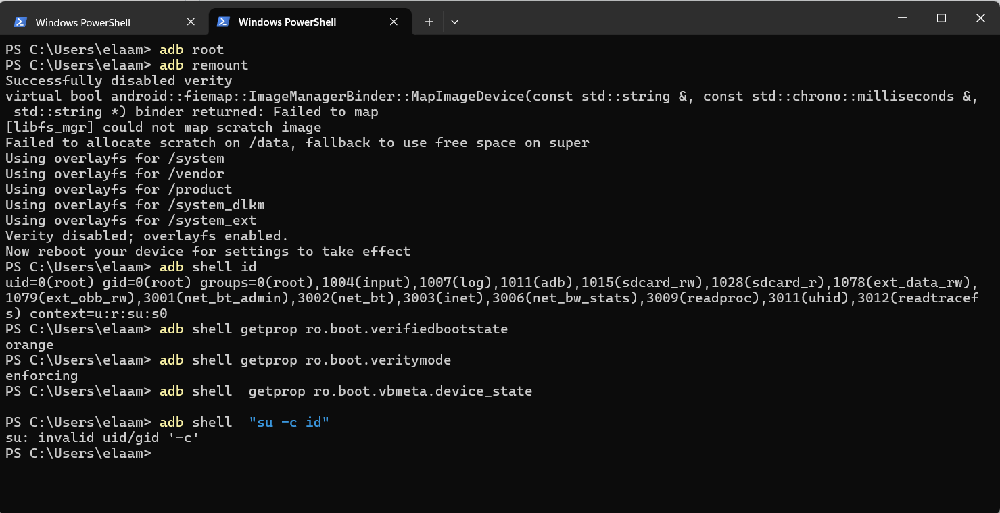
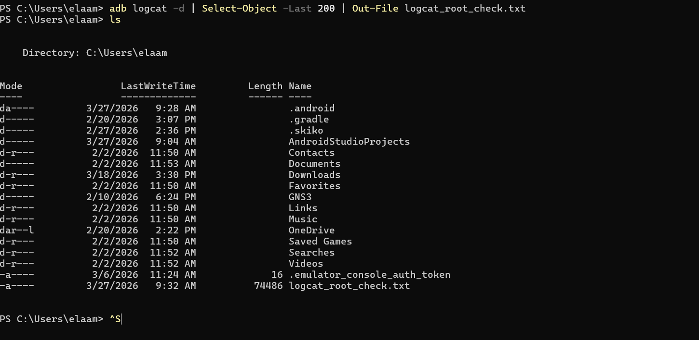
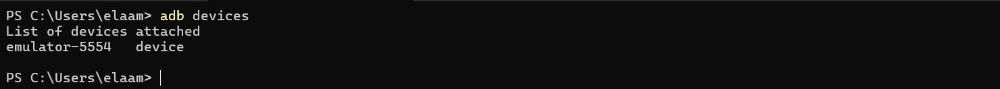
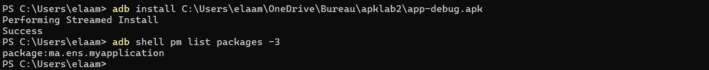
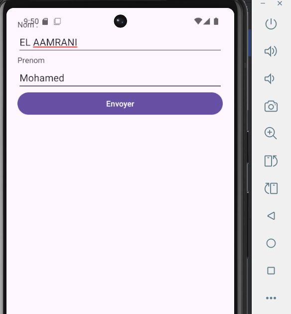
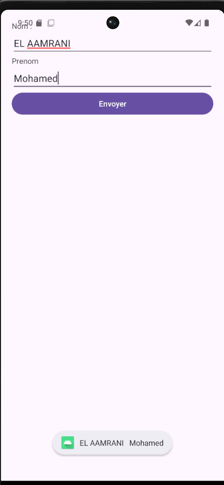
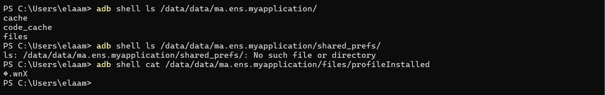
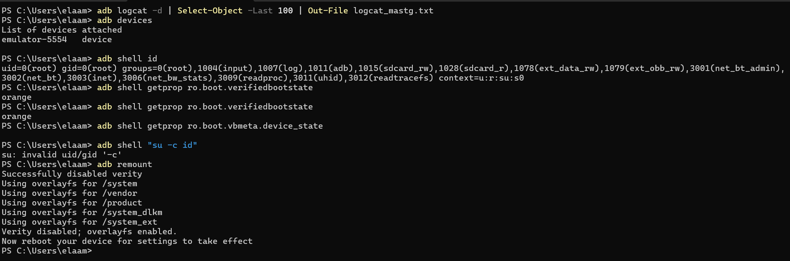

🔐 LAB 2 — Rooting Android
---
1. 🎯 Objectif
Ce laboratoire vise à :
Comprendre l’impact du rooting Android
Vérifier l’accès root sur un AVD
Installer et tester une application
Inspecter le stockage local
Réinitialiser l’environnement
---
2. 🧪 Environnement
Élément	Valeur
Émulateur	rooted_avd
Appareil	Pixel 6
Android	API 36
Image	Google APIs x86_64
App	`ma.ens.myapplication`
Réseau	Isolé
---
3. 🔓 Vérification du root
Commandes utilisées
```bash
adb root
adb remount
adb shell id
adb shell getprop ro.boot.verifiedbootstate
adb shell getprop ro.boot.veritymode
adb shell getprop ro.boot.vbmeta.device_state
adb shell "su -c id"
```
Résultats
`uid=0(root)` ✅
`verifiedbootstate = orange`
`veritymode = enforcing`
`su -c id` inutile (déjà root)
📸 Capture

---
4. 📜 Export des logs
```bash
adb logcat -d | Select-Object -Last 200 | Out-File logcat_root_check.txt
```
📸 Capture

---
5. 📡 Vérification de l’AVD
```bash
adb devices
```
Résultat :
```
emulator-5554 device
```
📸 Capture

---
6. 📦 Installation APK
```bash
adb install app-debug.apk
adb shell pm list packages -3
```
Résultat :
```
ma.ens.myapplication
```
📸 Capture

---
7. 📱 Exécution de l’application
Interface :
Champ Nom
Champ Prénom
Bouton Envoyer
Test effectué :
Nom : EL AAMRANI
Prénom : Mohamed
Résultat :
Affichage via Toast
📸 Captures
  

---
8. 📂 Inspection du stockage
```bash
adb shell ls /data/data/ma.ens.myapplication/
adb shell ls /data/data/ma.ens.myapplication/shared_prefs/
adb shell cat /data/data/ma.ens.myapplication/files/profileInstalled
```
Observations :
Dossiers :
`cache`
`code_cache`
`files`
❌ Pas de `shared_prefs`
`profileInstalled` = binaire
📸 Capture

---
9. 🛡️ Sécurité Android
Sandbox par application
Permissions contrôlées
Protection système (Verified Boot)
👉 Le root bypass ces protections
---
10. 🔐 Verified Boot
État	Signification
Green	Intact
Orange	Modifié
Red	Compromis
👉 Ici : Orange = normal après root
---
11. ⚙️ AVB (Android Verified Boot)
Vérification cryptographique
Protection contre rollback
---
12. ⚠️ Risques du Root
🔻 Intégrité réduite
🔓 Surface d’attaque ↑
📂 Accès aux données sensibles
---
13. 🧩 Bonnes pratiques
AVD dédié
Données fictives
Pas de comptes perso
Logs sauvegardés
Reset en fin de test
---
14. ♻️ Reset AVD
Via Wipe Data (Android Studio)
📸 Capture

---
15. 🧰 Commandes clés
```bash
adb root
adb remount
adb shell id
adb devices
adb install app-debug.apk
adb shell pm list packages -3
adb shell ls /data/data/<package>
adb logcat -d
```
---
16. 🧾 Conclusion
Root = accès total système
Verified Boot → orange
Inspection possible des données
Reset essentiel après test
👉 À utiliser uniquement en environnement contrôlé
