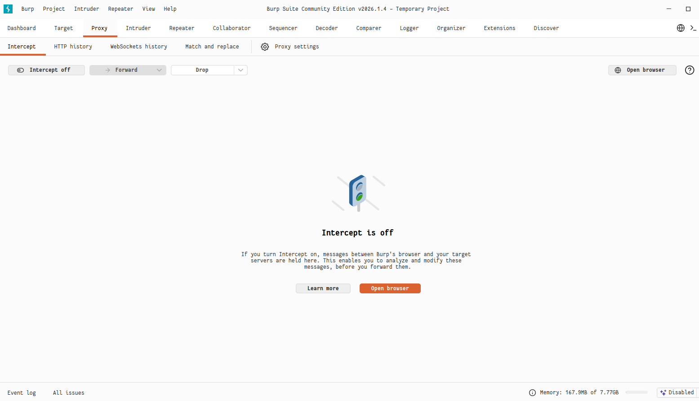
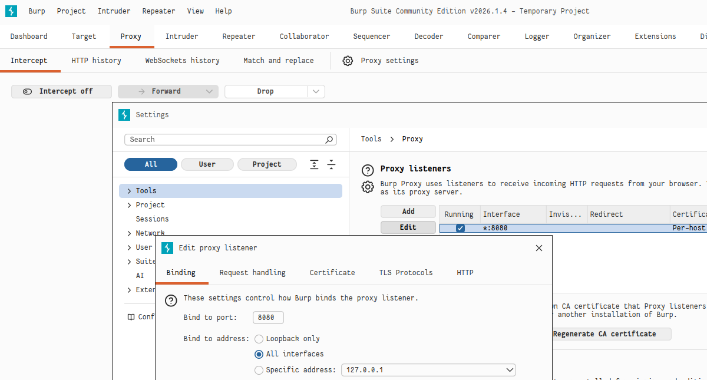
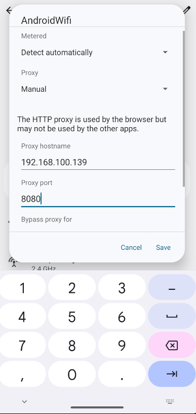
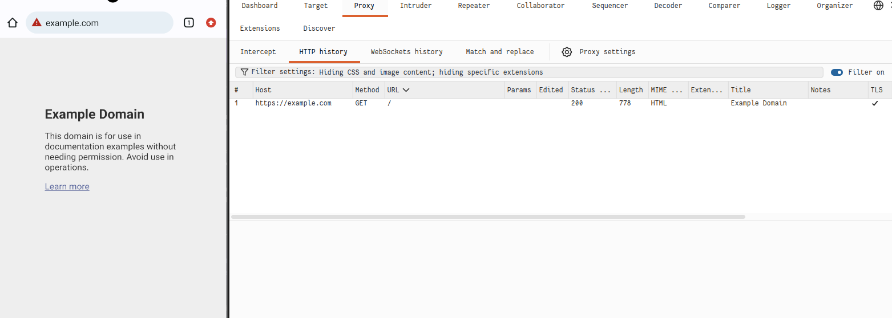
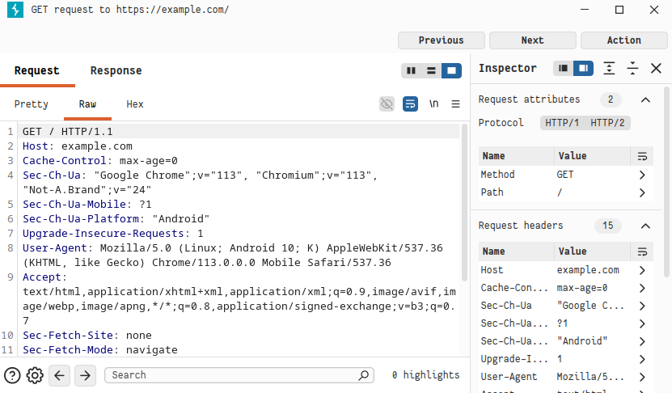
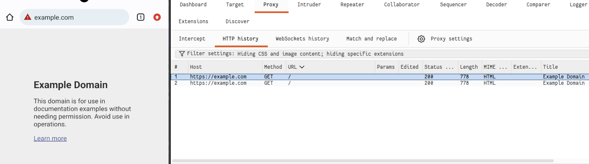
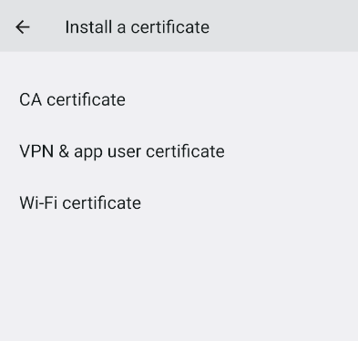
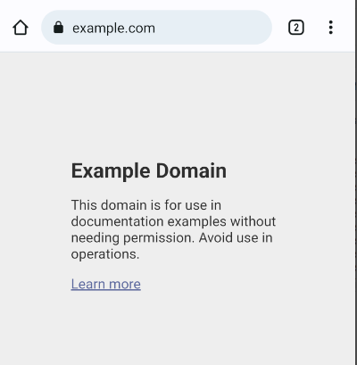

# Installation
Ce fichier `README.md` présente les différentes manipulations réalisées dans le cadre du **Lab 3**.

# Étape 1
Lancer **Burp Suite** et vérifier que l’option **"Intercept is off"** est bien affichée :

# Étape 2
Configurer les paramètres du proxy afin de permettre la communication entre l’émulateur Android et **Burp Suite** :

# Étape 3
Renseigner dans l’émulateur l’adresse de l’hôte ainsi que le port utilisé par **Burp Suite** pour établir la connexion via le proxy :

# Étape 4
Vérifier que **Burp Suite** intercepte correctement les requêtes HTTP envoyées depuis l’émulateur :

# Étape 5
Consulter le contenu de la requête HTTP dans l’onglet **RAW** afin d’examiner en détail sa structure :

# Étape 6
Tester l’interception des requêtes en activant l’option **"Intercept is on"**.

# Étape 7
Installer le certificat **CA**. Avant cette installation, **Chrome** signale que la connexion n’est pas sécurisée.

## Étape 7 - 1
Accéder aux paramètres de gestion des certificats **CA** afin de lancer l’installation :

## Étape 7 - 2
Après l’installation du certificat, la connexion devient sécurisée pour les échanges **HTTP** et **HTTPS** :

