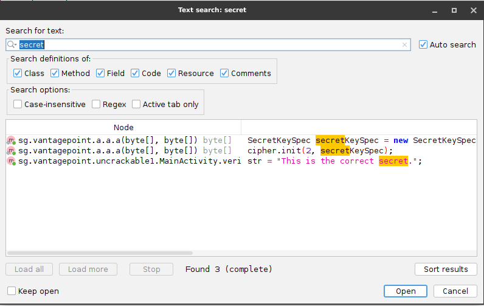
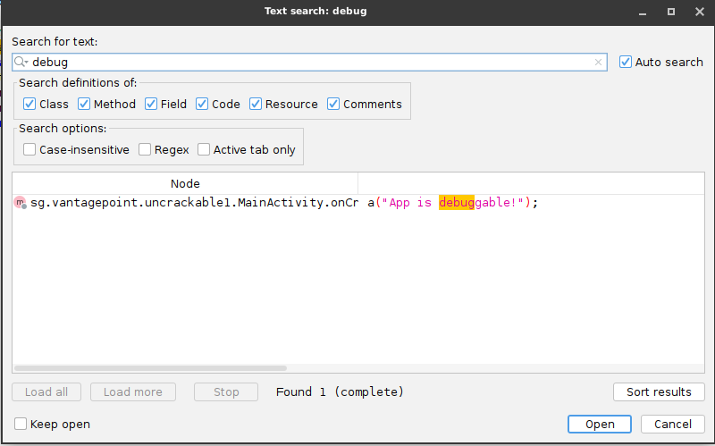

# Rapport d’analyse statique de l’APK UnCrackable-Level1

## 1. Informations de base
- **Date :** 3 mars 2026    
- **Application analysée :** UnCrackable-Level1.apk  
- **Version :** 1.0 (`versionCode: 1`)  
- **Source :** OWASP MSTG  
- **Outils employés :** JADX GUI, dex2jar v2.4, unzip  

---

## 2. Synthèse

L’examen statique de l’application **UnCrackable-Level1** a mis en évidence plusieurs points faibles au niveau du code et de la protection de l’APK.  
L’analyse montre en particulier la présence d’informations sensibles dans le code source, un contrôle lié au mode débogage, ainsi qu’une structure peu protégée contre la rétro-ingénierie.

Au total, **trois problèmes principaux** ont été relevés :

1. présence d’un secret accessible dans le code ;
2. vérification explicite de l’état *debuggable* ;
3. absence de mécanismes d’obfuscation efficaces.

Compte tenu de ces éléments, le **niveau de risque global** peut être considéré comme **élevé**.

### Recommandations prioritaires
1. retirer toute donnée sensible du code source ;
2. désactiver les options de débogage dans la version de production ;
3. renforcer la protection du code par obfuscation.

---

## 3. Résultats détaillés

### Constat n°1 : Vérification de l’APK

L’archive analysée correspond bien à un fichier APK valide.  
Sa taille est de **66 748 octets** et son contenu comprend **13 fichiers**, parmi lesquels `classes.dex` et `AndroidManifest.xml`, ce qui confirme la structure classique d’une application Android.

---

### Constat n°2 : Analyse du manifeste

Le fichier manifeste indique que l’application utilise le package **`owasp.mstg.uncrackable1`**.  
Une seule activité principale est déclarée : **`MainActivity`**, utilisée comme point d’entrée de l’application.

---

### Constat n°3 : Présence d’éléments sensibles

La recherche du terme **"secret"** dans le code fait apparaître plusieurs éléments intéressants, notamment la chaîne :

**"This is the correct secret."**

On observe aussi l’usage de **`SecretKeySpec`**, ce qui montre la présence d’un mécanisme cryptographique dans l’application.  
Ces indices laissent penser qu’une donnée sensible ou une logique de validation est directement intégrée dans le code.

---

### Constat n°4 : Extraction et conversion du DEX

Le fichier **`classes.dex`** a été récupéré puis transformé en **JAR** à l’aide de **dex2jar** afin de faciliter l’examen du contenu applicatif.  
Cette étape a permis de poursuivre l’analyse sur une version plus exploitable du code.

---

### Constat n°5 : Lecture du code décompilé

Le résultat de la décompilation montre une structure relativement lisible : les classes, méthodes et portions de logique restent compréhensibles.  
Cela rend l’application plus simple à analyser et confirme l’absence d’un niveau élevé d’obfuscation.

---

### Constat n°6 : Détection du mode debug

Le code contient le message :

**"App is debuggable!"**

Cela montre que l’application effectue un test pour savoir si elle est lancée dans un contexte favorable au débogage.  
Même si ce contrôle vise à renforcer la sécurité, il révèle aussi une logique interne exploitable ou observable par un analyste.

---

## 4. Conclusion

Cette étude statique de **UnCrackable-Level1** montre que l’application embarque plusieurs mécanismes visibles dans le code, dont certains exposent des informations importantes pour un attaquant.  
Le stockage de données sensibles dans le code, la lisibilité de la structure interne et la faible résistance à la rétro-ingénierie augmentent le risque de compromission.

Une sécurisation plus poussée devrait inclure :
- la suppression des secrets codés en dur ;
- une meilleure configuration de build pour la production ;
- l’utilisation d’outils d’obfuscation adaptés.
