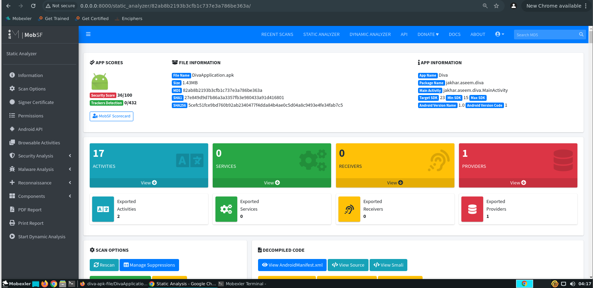
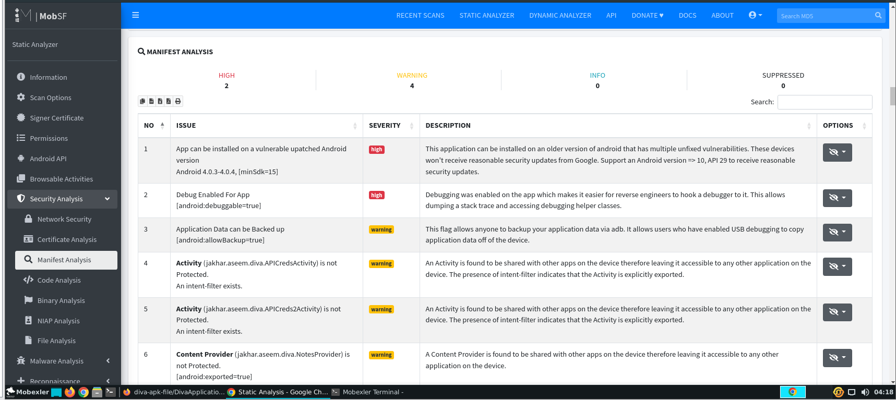
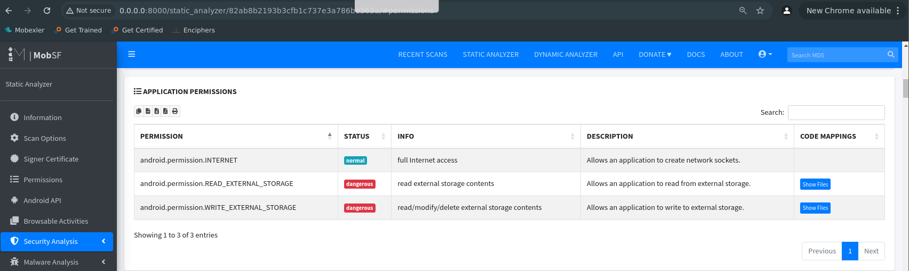
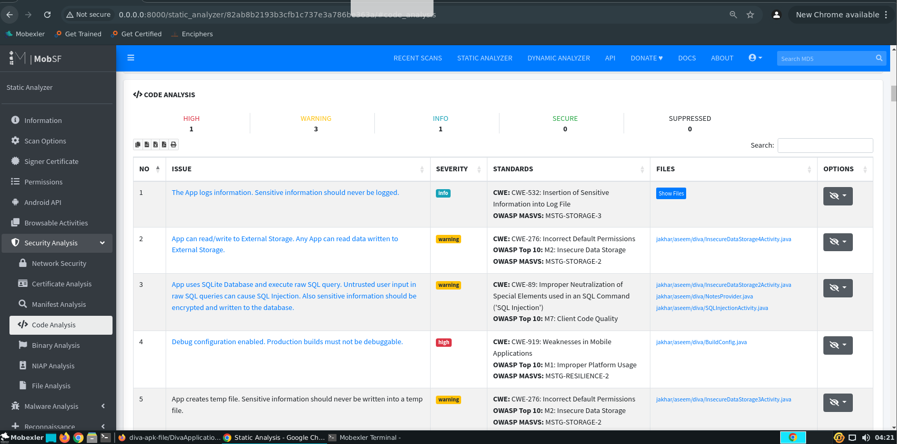
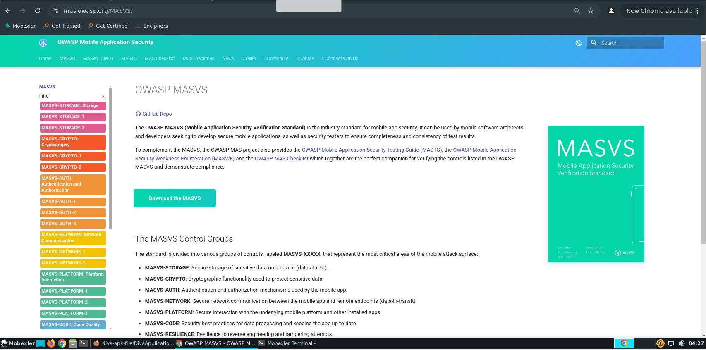
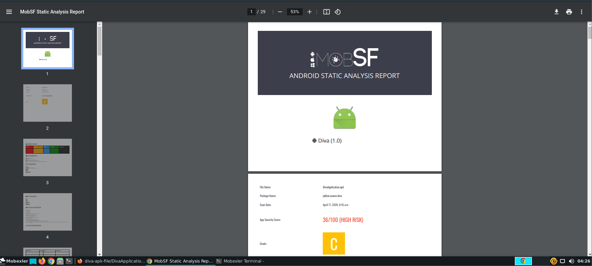

# 📱 Mobile Security Analysis with MobSF

## 🛠️ Environment Setup

**Figure 1 — MobSF Initialization**

MobSF is launched successfully on a local Ubuntu machine.  
The framework starts a web server on `http://0.0.0.0:8000` using Gunicorn, ready to analyze mobile applications.

---

## 📤 Uploading the APK

**Figure 2 — MobSF Upload Interface**

This is the main dashboard of MobSF where users can upload an APK file for analysis.  
The interface allows drag-and-drop or manual upload.

---

## 📊 General Scan Results

**Figure 3 — Static Analysis Overview**

MobSF provides a summary of the application:
- Security Score: **36/100 (High Risk)**
- App metadata (name, package, SDK versions)
- Number of Activities, Services, Receivers, Providers

This gives a quick understanding of the app’s security posture.

---

## ⚠️ Manifest Analysis

**Figure 4 — AndroidManifest Security Issues**

MobSF identifies issues in the `AndroidManifest.xml`:
- Debug mode enabled (`android:debuggable=true`)
- App supports old Android versions (vulnerable)
- Exported activities accessible by other apps
- Backup enabled (data leakage risk)

These misconfigurations can be exploited by attackers.

---

## 🔐 Permissions Analysis

**Figure 5 — Application Permissions**

The app requests several permissions:
- Internet access (normal)
- Read/Write external storage (**dangerous**)

These permissions may expose sensitive user data if abused.

---

## 🌐 Domain & Network Check

**Figure 6 — Domain Malware Check**

MobSF detects external domains used by the app:
- Example: `payatu.com`

It also provides:
- IP address
- Geolocation
- Associated source code reference

Useful for detecting suspicious communications.

---

## 🧠 Code Analysis

**Figure 7 — Source Code Vulnerabilities**

MobSF highlights insecure coding practices:
- Sensitive data logged
- Use of raw SQL queries (SQL Injection risk)
- Debug configuration enabled
- Insecure data storage (temp files)

Mapped to:
- CWE (Common Weakness Enumeration)
- OWASP Top 10

---

## 📚 Security Standard Reference

**Figure 8 — OWASP MASVS Standard**

MobSF findings are aligned with **OWASP MASVS**, which defines best practices for mobile app security:
- Storage
- Cryptography
- Authentication
- Network security
- Code quality

---

## 📄 Final Report

**Figure 9 — Generated PDF Report**

MobSF generates a detailed report including:
- Security score
- Identified vulnerabilities
- Risk classification

This report can be used for documentation or professional audits.

---
