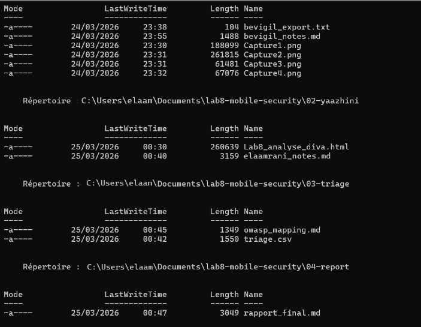
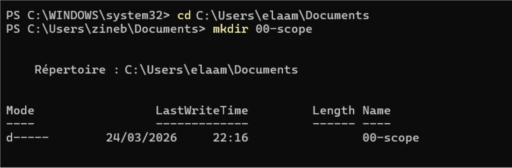
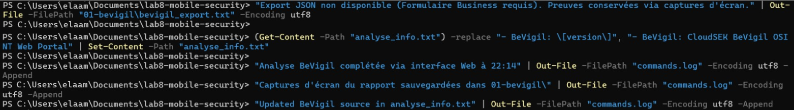
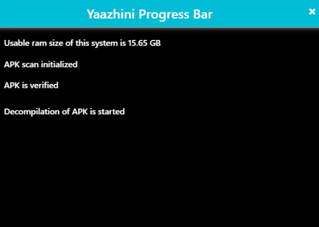
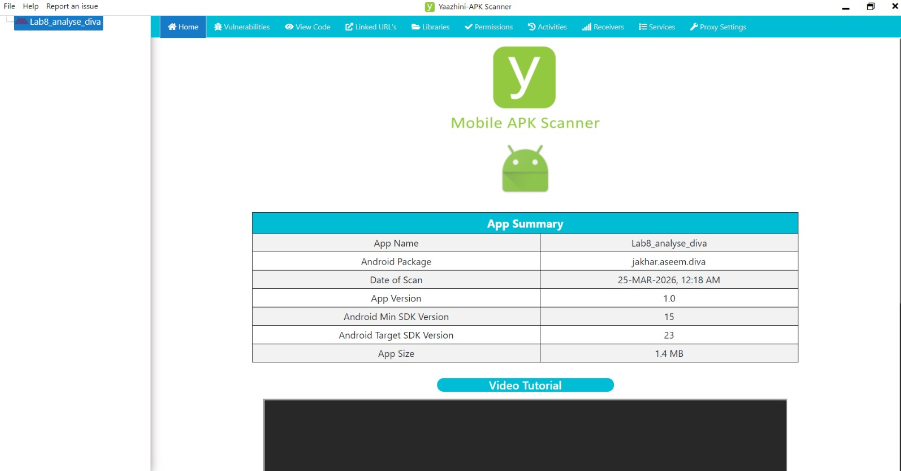
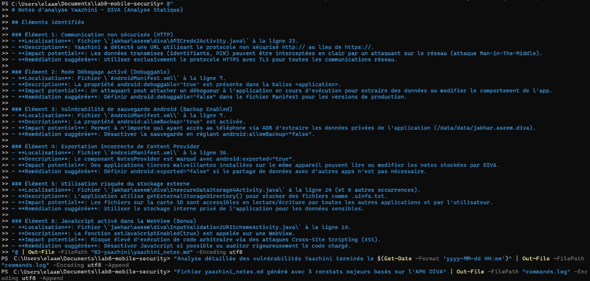
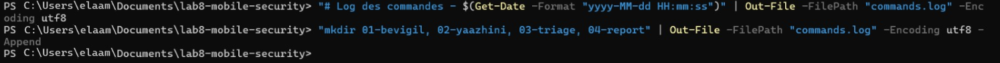
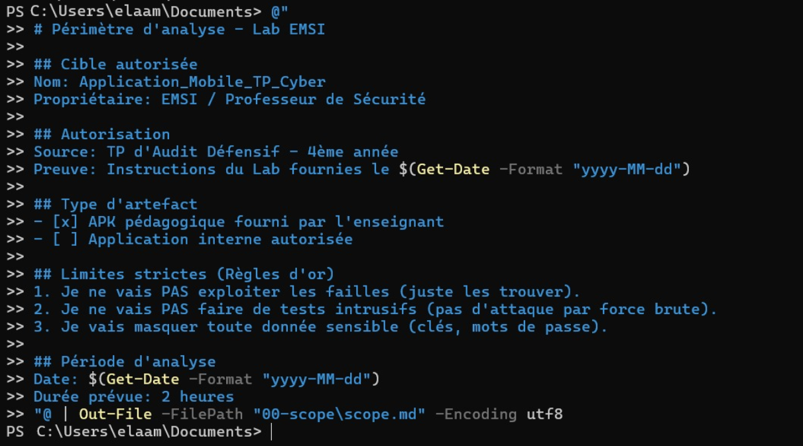
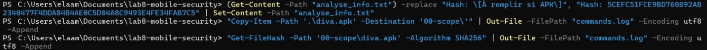
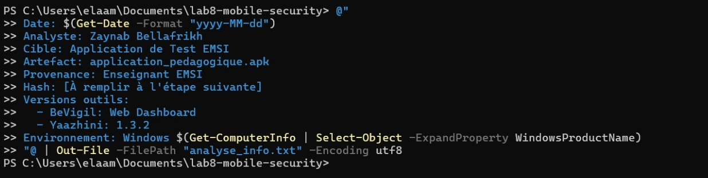

# Mobile Application Security Analysis Lab Report



<p align="center">
  
  
  
  
</p>

---

# Overview

This laboratory report presents a mobile application security assessment performed on the vulnerable Android application:

- DIVA (Damn Insecure Vulnerable App)

The analysis focuses on:

- Static analysis (SAST)
- OSINT exposure
- APK inspection
- Permissions review
- Manifest analysis
- Vulnerability triage

---

# Tools Used

| Tool | Purpose |
|------|----------|
| BeVigil | OSINT & APK exposure analysis |
| Yaazhini | Static APK analysis |
| PowerShell | Automation & evidence collection |

---

# Step 0 — Environment Initialization

```powershell
mkdir 00-scope
mkdir 01-bevigil
mkdir 02-yaazhini
mkdir 03-triage
mkdir 04-report
```






---

# Step 1 — Define Scope

```powershell
Get-FileHash -Path "00-scope\diva.apk" -Algorithm SHA256
```




---

# Step 2 — Analysis Information

Preparation of analysis metadata and environment information.



---

# Step 3 — BeVigil Analysis

Upload and scan the APK using CloudSEK BeVigil.






---

# Step 4 — BeVigil Findings

Detected findings include:

- SQL Injection indicators
- Sensitive logs
- Hardcoded credentials
- Risky storage permissions




---

# Step 5 — Yaazhini Static Analysis

Static analysis of the APK using Yaazhini.






---

# Step 6 — Yaazhini Findings

Main vulnerabilities identified:

- HTTP communication
- Debuggable mode enabled
- Android allowBackup=true
- Exported components
- Insecure external storage
- JavaScript enabled inside WebView


---

# Step 7 — Triage & Correlation

Normalization and classification of vulnerabilities.


---

# Main Findings

1. HTTP communication without TLS
2. Debuggable flag enabled
3. Android backups allowed
4. Excessive storage permissions
5. Potential SQL Injection
6. Exported Android components
7. Sensitive logs exposure

---

# Recommendations

- Enforce HTTPS everywhere
- Disable Debuggable mode
- Set allowBackup=false
- Reduce dangerous permissions
- Secure sensitive data storage

---

# Disclaimer

This project is intended for educational and authorized security testing purposes only.

---

# References

- https://owasp.org/www-project-mobile-top-10/
- https://mas.owasp.org/
- https://github.com/payatu/diva-android
