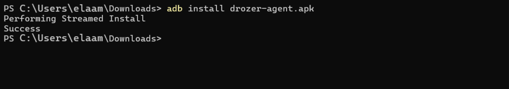
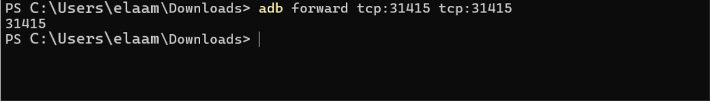
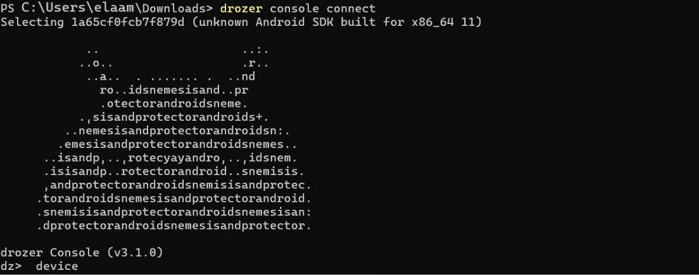

# 🛡️ Analyse de Sécurité Android avec Drozer — Étude Pratique DIVA

## 📌 Introduction

Ce projet présente un audit de sécurité mobile réalisé sur l’application Android vulnérable **DIVA (Damn Insecure and Vulnerable App)** à l’aide de l’outil **Drozer**.  
L’objectif principal est d’identifier les faiblesses liées aux composants Android exportés et aux mauvaises configurations de sécurité pouvant permettre des accès non autorisés aux données internes de l’application.

Cette étude met en avant plusieurs scénarios d’exploitation réels afin de mieux comprendre les risques liés aux applications Android mal sécurisées.

---

# 🎯 Objectifs du TP

- Comprendre le fonctionnement du modèle de sécurité Android.
- Découvrir l’utilisation du framework **Drozer**.
- Identifier les composants Android exposés.
- Tester les risques liés aux `Content Providers`, `Activities` et permissions.
- Étudier certaines recommandations du standard **OWASP MASVS**.

---

# 🧰 Environnement Utilisé

| Outil | Description |
|---|---|
| Android Studio / Emulator | Machine Android virtuelle |
| ADB | Communication entre PC et Android |
| Drozer | Framework d’audit Android |
| DIVA | Application Android volontairement vulnérable |

---

# ⚙️ Mise en Place du Laboratoire

## Vérification de la connexion ADB


Cette étape permet de confirmer que l’émulateur Android est correctement détecté par `adb`.

---

## Installation de l’agent Drozer



L’APK de Drozer Agent est installé sur l’émulateur Android afin de permettre les interactions avec les composants système.

---

## Démarrage du serveur Drozer


Le serveur Drozer doit être lancé sur le port `31415` pour accepter les connexions distantes.

---

## Redirection de port



Le `port forwarding` relie le port local de la machine hôte au port utilisé par Drozer dans l’émulateur.

Commande utilisée :

```bash
adb forward tcp:31415 tcp:31415
```

---

# 🔎 Analyse de l’Application

## Connexion à Drozer



Connexion établie entre la console Drozer et l’agent Android.

---

## Identification des informations du package


Cette étape permet d’obtenir différentes informations concernant l’application :

- permissions demandées
- activités exportées
- services disponibles
- providers accessibles

On remarque notamment l’utilisation de permissions liées au stockage externe.

---

# 📂 Étude des Content Providers

Les `Content Providers` servent au partage de données entre applications Android.  
Une mauvaise configuration peut exposer des informations sensibles.

---

## Recherche des providers exportés


Le provider `NotesProvider` apparaît comme exporté sans protection spécifique.

Cela signifie qu’une application externe pourrait potentiellement lire ou modifier les données stockées.

---

## Scan des URI disponibles


Le scan des URI confirme que certaines routes sont accessibles publiquement.

Exemple :

```text
content://jakhar.aseem.diva.provider.notesprovider/notes
```

---

# ⚠️ Vulnérabilités Identifiées

## 1. Activités Exportées

Certaines activités sensibles sont accessibles depuis l’extérieur de l’application.

### Risques

- fuite d’informations
- lancement d’activités internes
- récupération de données sensibles

---

## 2. Content Provider Non Sécurisé

Le provider de notes ne vérifie pas les permissions de l’appelant.

### Impact

Une application malveillante pourrait récupérer les données utilisateur sans autorisation.

---

## 3. Mode Debug Activé

L’application possède le flag :

```xml
android:debuggable="true"
```

### Conséquences

- débogage de l’application en temps réel
- extraction de variables mémoire
- analyse dynamique simplifiée

---

# 📊 Tableau de Synthèse

| ID | Élément | Vulnérabilité | Niveau |
|---|---|---|---|
| V1 | NotesProvider | Provider exporté sans permissions | Critique |
| V2 | Activities | Activités sensibles accessibles | Critique |
| V3 | Application | Debug activé | Élevé |
| V4 | SDK ancien | Compatibilité avec versions obsolètes | Moyen |

---

# 🛠️ Recommandations

## Sécuriser les composants exportés

Définir :

```xml
android:exported="false"
```

pour tous les composants qui ne doivent pas être accessibles publiquement.

---

## Ajouter des permissions personnalisées

Limiter l’accès aux composants sensibles via des permissions de niveau `signature`.

---

## Désactiver le mode debug

Avant toute mise en production :

```xml
android:debuggable="false"
```

---

## Utiliser une version SDK récente

Mettre à jour :

```xml
minSdkVersion
targetSdkVersion
```

afin de profiter des correctifs de sécurité récents.

---

# ✅ Conclusion

Cette analyse démontre l’importance de la configuration de sécurité Android, notamment au niveau du fichier `AndroidManifest.xml`.

Grâce à Drozer, il est possible d’identifier rapidement plusieurs vecteurs d’attaque liés aux composants IPC Android et d’évaluer leur impact avant la mise en production d’une application mobile.

L’utilisation d’outils d’audit comme Drozer reste essentielle pour renforcer la sécurité des applications Android modernes.
